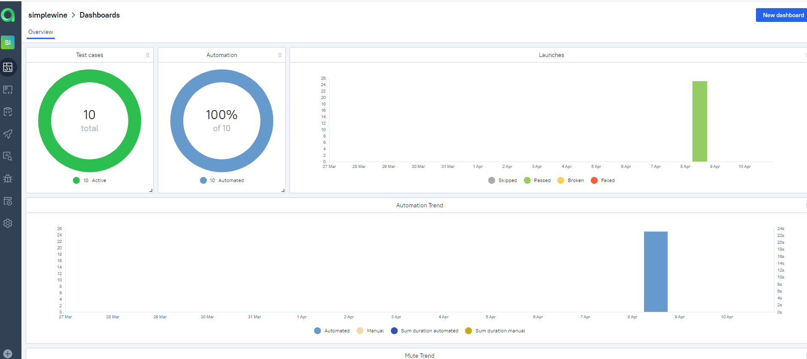

<h1 >Проект автоматизации тестирования на примере web сайта SimpleWine и open source app</h1>

## Содержание

* <a href="#annotation">Описание</a>
* <a href="#tools">Технологии и инструменты</a>
* <a href="#cases">Реализованные проверки</a>
* <a href="#console">Запуск тестов из терминала</a>
* <a href="#jenkins">Запуск тестов в Jenkins</a>
* <a href="#allure">Отчеты в Allure</a>
* <a href="#testops">Интеграция с Allure TestOps</a>
* <a href="#testops">Интеграция с Jira</a>
* <a href="#telegram">Уведомления в Telegram с использованием бота</a>
* <a href="#video">Пример прогона теста в Selenoid</a>

<a id="annotation"></a>
## Описание
Разработаны UI и API тесты для web-сайта <a href="https://simplewine.ru/ ">SimpleWine</a>, и тесты для запуска на Android платформе для open source приложения <a href="https://github.com/wikimedia/apps-android-wikipedia ">Wikipedia</a>

Краткий список интересных фактов о проекте:
- [x] `Page Object` проектирование
- [x] Конфигурация с использованием техноголии `Owner` для запуска тестов в зависимости от параметров сборки
- [x] Возможность локального и удалённого запуска тестов
- [x] Использование `Lombok` для моделей в API тестах
- [x] Использование request/response спецификаций для API тестов
- [x] Custom Allure listener для API requests/responses логов
- [x] Интеграция с `Allure TestOps`
- [x] Возможность запуска тестов напрямую из `Allure TestOps`
- [x] Интеграция с `Jira`
- [x] Автотесты оформлены как тестовая документация с помощью аннотаций `Allure`


<a id="tools"></a>
## Технологии и инструменты

<div align="center">
<a href="https://www.jetbrains.com/idea/"></a>
<a href="https://github.com/"></a>  
<a href="https://www.java.com/"></a>
<a href="https://gradle.org/"></a>  
<a href="https://junit.org/junit5/"></a>
<a href="https://selenide.org/"></a>
<a href="https://aerokube.com/selenoid/"></a>
<a href="https://rest-assured.io/"></a>
<a href="https://www.browserstack.com/"></a>
<a href="https://appium.io/"></a>
<a href="https://developer.android.com/studio"></a>
<a href="https://www.jenkins.io/"></a>
<a href="https://github.com/allure-framework/"></a>
<a href="https://qameta.io/"></a>
<a href="https://www.atlassian.com/software/jira"></a>  
<a href="https://telegram.org/"></a>
</div>

Автотесты в этом проекте написаны на Java с использованием фреймворка [Selenide](https://selenide.org/).\
<code>Gradle</code> — используется как инструмент автоматизации сборки.\
<code>JUnit5</code> — для выполнения тестов.\
<code>Selenoid</code> — для удаленного запуска браузера в Docker контейнерах.\
<code>REST Assured</code> — для тестирования REST-API сервисов.\
<code>Jenkins</code> — CI/CD для запуска тестов удаленно.\
<code>Browserstack</code> — для запуска мобильных тестов удаленно.\
<code>Appium</code>, <code>Android Studio</code> — для запуска мобильных тестов локально на эмуляторе мобильных устройств.\
<code>Allure Report</code> — для визуализации результатов тестирования.\
<code>Allure TestOps</code> — как система управления тестированием.\
<code>Jira</code> — как инструмент управления проектом и таск-трекер.\
<code>Telegram Bot</code> — для уведомлений о результатах тестирования.

Allure-отчет включает в себя:
* шаги выполнения тестов;
* скриншот страницы в браузере в момент окончания автотеста;
* Page Source;
* логи браузерной консоли;
* видео выполнения автотеста.

<a id="cases"></a>
## Реализованные проверки

### Автоматизированные проверки WEB
:heavy_check_mark: Перед началом поиска продукта показ попапа с актуальными предложениями

:heavy_check_mark: Валидация поля отправки email для подписки на акции и предложения компании

:heavy_check_mark: Показ попап для неавторизованного пользователя в разделе избранного

:heavy_check_mark: В футере главной страницы есть карточки проектов компании SimpleWine с соответствующими ссылками

:heavy_check_mark: Кнопка "Пользовательские соглашения и условия" в футере главной страницы содержит ссылку на актуальный документ 

### Автоматизированные проверки API
:heavy_check_mark: Добавление продукта в корзину

:heavy_check_mark: Очистка корзины

:heavy_check_mark: Просмотр содержимого корзины

:heavy_check_mark: Отправка email для подписки на акции и предложения компании

:heavy_check_mark: Негативный тест отправки email для подписки на акции и предложения компании


### Автоматизированные проверки MOBILE
:heavy_check_mark: Увеличение главной картинки в статье после клика 

:heavy_check_mark: Очистка истории поиска

:heavy_check_mark: Отмена удаления истории поиска

:heavy_check_mark: Просмотр истории измения статьи

:heavy_check_mark: Переход на экран регистрации аккаунта через иконку гамбургера в нижнем таббаре


<a id="console"></a>
##  Запуск тестов из терминала
#### WEB

*локально*
```
gradle clean ui -Denv=locale   
```
*удаленно*
```
gradle clean ui -Denv=remote   
```

#### API

```
gradle clean api
```

#### MOBILE

Запуск мобильных тестов возможен на эмуляторе (локально) и на <a href="https://www.browserstack.com/ ">Browserstack</a> (удаленно).

*локально*
```
gradle clean mobile_emulation -Denv=emulation
```
*удаленно*
```
gradle clean clean browserstack -Denv=browserstack
```


### Удаленный запуск тестов

```
clean remote_test
"-Dbrowser=${BROWSER}"
"-DbrowserVersion=${BROWSER_VERSION}"
"-DbrowserSize=${BROWSER_SIZE}"
"-DremoteUrl=${REMOTE_URL}"
```

> `${BROWSER}` - наименование браузера (_по умолчанию - <code>chrome</code>_).
>
> `${BROWSER_VERSION}` - номер версии браузера (_по умолчанию - <code>100.0</code>_).
>
> `${BROWSER_SIZE}` - размер окна браузера (_по умолчанию - <code>1980x1080</code>_).
>
> `${REMOTE_URL}` - адрес удаленного сервера, на котором будут запускаться тесты.

### Допустимые комбинации:


<a id="jenkins"></a>
## Запуск тестов в <a target="_blank" href="https://jenkins.autotests.cloud/job/017-Jenny_Ndbn-java-24-webinar-final-project/"> Jenkins </a>

> Сборка с параметрами позволяет перед запуском изменить параметры для сборки (путем выбора из списка или прямым указанием значения).

<p align="center">

</p>

<a id="allure"></a>
## Отчеты в <a target="_blank" href="https://jenkins.autotests.cloud/job/017-Jenny_Ndbn-java-24-webinar-final-project/8/allure/"> Allure report </a>

### Основное окно

<p align="center">

</p>

### Тесты

<p align="center">

</p>

### Графики

<p align="center">

</p>

<a id="testops"></a>
## Интеграция с <a target="_blank" href="https://allure.autotests.cloud/project/2083/dashboards"> Allure TestOps </a>

### Доска
<p align="center">

</p>

### Тест-кейсы
<p align="center">

</p>


### Запуски сборок
<p align="center">

</p>

### Запуск выбранных тестов из Allure TestOps
<p align="center">

</p>


<a id="jira"></a>
## Интеграция с <a target="_blank" href="https://jira.autotests.cloud/browse/HOMEWORK-638"> Jira </a>
<p align="center">

</p>

<a id="telegram"></a>
## Уведомления в Telegram с использованием бота

<p>

</p>

<a id="video"></a>
## Пример прогона теста в Selenoid

> К каждому web-тесту в отчете прилагается видео
<p align="center">
  
</p>

> В случае запуска мобильного теста с помощью Browserstack к отчету также будет прилагаться видео
<p align="center">
  
</p>
